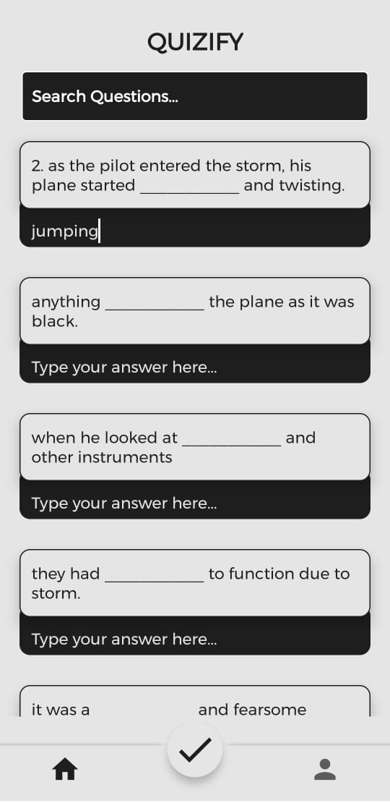

  

# **Q-gen**

### _Generate quizes from pdfs_

Q-gen is an app, that generates "fill in the black" type questions from the text-paragraphs entered by the user or the pdfs uploaded.

Developed by [Microsoft Learn Student Ambassador, SRMIST](https://msclubsrm.in/)

 

#### _The product can be used both by teachers as well as students._

### For Students :

> - Study from your materials and then up upload them into the app to generate questions. Answer the questions and get your score to evaluate yourself.
> - Or simply, avoid the hassle of studying from boring pdfs and let the app generate smart question & answers for you, boost your efficiency.

### For Teachers :

> - Want to avoid the hectic job of framing questions and answers for upcoming tests ?
> - Sit back and let Q-Gen do the hard work for you. The app generates questions & answers from the materials provided, all you have to do is review and publish them into the question paper.

 

## Platforms

> - [Q-gen Website](https://q-gen.netlify.app/) which can be accessed via any web browser
> - [Q-gen Android App]()

 

## Tools Used

> - Visual Studio Code
> - Google Chrome Browser
> - Android Studio

 

## Overview

## [Webapp](https://q-gen.netlify.app/)

|                                                                                |
| ------------------------------------------------------------------------------ |
|  |
|                                                                                |
|  |
|                                                                                |
|  |
|                                                                                |
|  |
|                                                                                |

 

## [Android App](https://q-gen.netlify.app/)

|                                                                     |     |                                                                     |
| ------------------------------------------------------------------- | --- | ------------------------------------------------------------------- |
|  |     |  |
|  |     |  |
|                                                                     |     |

 

## For contribution to the project

## Prerequisites

> - python 3.6 or above
> - node.js installed version 14.7.1 or above
> - android studio (kotlin)

## Installation

### For running the backend server

> flask server in local machine

- `cd api`
- `install pipenv`
- `pipenv shell`
  > before shell download python 3.6 or set the python version in pipfile
- `pipenv install`
- `flask run`

  ### OR

- `cd api`
- `pip install -r requirements.txt`
- `flask run`

**_the server will run on_** [localhost port 5000](http://localhost:5000)

### The API endpoints for the live backend

> the flask server is live

- https://localhost:5000/filetotext

  - **_POST_**
  - **_it recieves file as req ex:-{"file":<---files--->}_**
  - **_response extracted text in json ex:-{"data":"extracted text","success":"true"}_**

- https://localhost:5000/filetoquestion

  - **_POST_**
  - **_it recieves file as req ex:-{"file":<---files--->}_**
  - **_response question and ans json ex:-{"answers":"answer","question":"question"}_**

- https://localhost:5000/texttoquestion
  - **_POST_**
  - **_it recieves text as req ex:-{"key":"any text to be converted to question"}_**
  - **_response question and ans json ex:-{"answers":"answer","question":"question"}_**

### For running the react frontend

> React development server in local machine

- `cd client`
- `npm install`
- `npm start`

**_the server will run on_** [localhost port 3000](http://localhost:3000)

Use Concurrently for running React in Front-end and Node in Back-end.
Runs the app in the development mode. 

Open [http://localhost:3000](http://localhost:3000) to view Front-end in the browser. 
Open [http://localhost:5000](http://localhost:5000) to view Back-end in the browser.

The page will reload if you make edits. 
You will also see any lint errors in the console.

 
 
